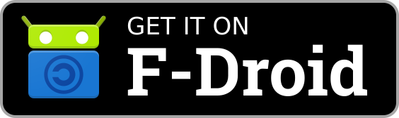
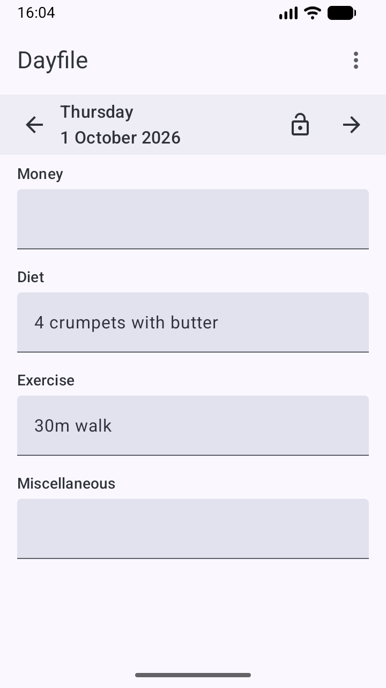

&nbsp;&nbsp;

# Overview

This Android app helps you make notes about your daily life. It works entirely offline, so your notes are private and it's your responsibility to back them up so you don't lose them if something happens to your phone.

The idea is that making a note should be as low-friction as possible. You open the app, you type, you close or background the app. The note is automatically attached to the current date. You can optionally have pre-defined categories to help to split up the day's notes but that's it. Entries are free text with no attempt at imposing a structure beyond the categories. There are no reminders or alarms. There is no formal support for any time tracking more precise than "a day".

There's nothing wrong with more structured note-taking, and there's no shortage of apps that will help you do it. The emphasis here is on being able to make a quick note with minimal ceremony. The less effort it is to make the note, the more likely it is that you'll invest the time to make it.

This is almost embarrassingly primitive, which is the whole point. You can use a text editor to make notes, but you have to make sure you have the right file open, you have to make sure you enter the date correctly, etc. You can use a calendar app but it isn't easy to review the notes after, such apps are naturally organised around making entries for arbitrary future dates and you probably don't want your random "what I did today" notes getting mixed in with your formal appointments. You can use a journalling app, but that might be too heavyweight or prone to inspirational reminders if you just want to write down that you went for a 30 minute walk.

The uses are, as they say, limited only by your imagination. Try it and see, feel free to pair it with a more structured app to get the best of both worlds if that works for you.

# Getting started

On first run the app creates some plausible demonstration categories. You are of course free to edit these - use the overflow menu at the top right of the main screen to go to the category editor. The switches on this screen enable and disable categories. Disabling a category is pragmatically very similar to deleting it, but if you really want to fully delete a category you can disable it and then choose the delete option from the category's triple dot menu (which is greyed out for enabled categories to avoid accidents).

The basic use of the app should otherwise be fairly straightforward and you will likely figure it out for yourself. Note that you must use the Settings->Backup option to perform backups at suitable intervals, otherwise you risk losing your notes. The most unusual aspect of the app is the way the history works - this is effectively a very safe if unconventional form of undo. Read on for more details on the various features.

# Main screen

The app's main screen shows the log entries for a specific date, today by default: TODO: EXPERIMENT WITH SCALE OF THESE FULL-SCREEN SHOTS

You can use the left and right arrows next to the current date to move to the previous or next day respectively. You can also tap on the date to bring up a date selector.

The padlock icon - here shown as "unlocked" - indicates whether you are allowed to edit the displayed entries. The current date defaults to being unlocked, other dates default to being locked. The idea here is to make it hard for you to accidentally edit an entry for any day other than today, e.g. if you browsed back a few days and then put the app into the background before returning. Tapping the padlock icon will toggle it between locked and unlocked - you always have the choice to edit old entries (or future dates, for that matter), the app just doesn't want you to do it without realising. There is no persistent storage of whether a date is locked or not - as soon as you move from one date to another, any manual changes to the lock status are discarded.

Tapping on a category's text entry will allow you to edit it in the normal way, provided the date is not locked.

The triple dot icon at the top right allows you to access the app's menu in the usual way. This allows the category, history and settings screens to be accessed.

If you leave the app briefly (e.g. to check something in another app), it will remember the selected date and protection status when you return. After 10 minutes, re-opening the app will return you to the main screen for today no matter where you were when you left it.

# Categories

## Category list screen

The category screen shows the currently defined categories, in order, and allows you to add, edit, reorder and delete them. It consists of one row per category:

TODO *SINGLE ROW* SCREENSHOT

The drag handle at the left of the row allows you to reorder the categories. You can also move them up and down one step at a time using the corresponding options from the triple dot memnu at the right of the row.

The switch allows a category to be toggled between being enabled and disabled. A disabled category retains all its entries but it is not shown on the home screen until it is re-enabled.

Disabled categories can be deleted using the triple dot menu. Deleting a category deletes all its entries and cannot be undone, so you will be asked to confirm this before the app goes ahead. (This is also why you can't delete an enabled category; forcing you to disable it first adds an extra bit of friction.) Very recent changes to a deleted categories entries may still be present in the history; see the section on the history screen for more on this.

To add a new category, use the "+" button floating at the bottom right of the category screen. To edit an existing category, use the edit option from the row's triple dot menu.

TODO: MORE?!

## Category add/edit screen

The same screen is used to add a new category or edit an existing category:

TODO SCREENSHOT?

TODO

The keyboard hints allow you to influence how your phone's keyboard behaves when editing entries for this category on the main screen. Ultimately this is controlled by your keyboard, not this app, and different keyboards may behave differently. This app can only tell the keyboard that the user wants a certain behaviour, it can't force the keyboard to obey.

The auto-correct option tells the keyboard whether you want to use auto-correct when editing this category's entries. If you are typing regular words, phrases or sentences auto-correct is likely to be useful. If you are entering things using a personal code or abbreviations, auto-correct may be more of a nuisance than a help. Suppose you record how long your daily walk was.You regularly type "30m walk" in an "Exercise" category and your keyboard has noticed this. One day you go for a longer 35m walk, but when you type "35m " the keyboard helpfully auto-corrects it to "30m " and you have to fight the keyboard's auto-correct to let you record your actual walk correctly. You may not even notice it auto-correcting and accidentally leave an incorrect note. Turning auto-correct off might help avoid this.

The capitalisation option tells the keyboard how you would like automatic capitalisation to be applied for this category's entries:
* None tells it to leave capitalisation up to you, probably using lower case by default
* Sentences tells it to start each sentence (and probably each new line) with a capital.
* Words tells it to Capitalise Each Word Like This
* Characters tells it to capitalise everything, probably using upper case by default.

TODO: DOCUMENT T

# History screen

The app tracks the history of changes on the main screen, but only temporarily. (By default changes are recorded for 7 days, but this can be changed under Settings.) This is not intended to provide a useful long-term log of what changed and when. It is intended to provide a comprehensive if somewhat clunky undo feature. The intention is that normally you will completely ignore the existence of history, then when something goes wrong you will be glad it's there and not care that it isn't particularly slick.

Imagine you've typed something into the entry for today and it's both important but no longer in your memory. Maybe it's a phone number you're jotting down  - this app isn't the right place for that data long term, but because it is so easy to open the app and type instead of firing up your contacts app and creating a new entry, you might do that anyway. Maybe you just weighed an ingredient in a recipe and noted it down. Just as you finish typing it, you fumble your phone and as you scramble to catch it, your fingers brush the screen and corrupt or delete what you just typed. It's probably gone and you have to type it back in as best you can, assuming you remember. There might be some kind of context menu undo provided, but maybe not, and if there is there is probably a single level of undo and it will likely be gone shortly - you might not even notice you accidentally corrupted the entry for five minutes or an hour, and by then a traditional undo history is long gone.

Although there is some basic filtering to try to keep the noise down, the history in the app is a very noisy but almost complete history of everything you changed. As long as you're within the history retention period (7 days by default), you can browse the history for the day and see every previous version. This isn't friendly, but it does make it possible to recover from fumbles or other accidental edits. You can't edit things on the history screen, but you can select text (long press as usual), copy it to the clipboard and then paste it back into the right place on the main screen. *This is not friendly, but it is powerful*. If - as is usually the case - you aren't making editing mistakes, you can just ignore the existence of the history. When something goes wrong, it's better to have to hunt it out in the history and copy it back to the main screen than to have lost it completely.

The history screen always shows a single day's history, most recent versions first. You can show all categories or filter it to a specific category. You can also see deleted categories and any history for them - once a category is deleted, all of its entries from the main screen are deleted, but the history remains until it expires normally. This provides a limited additional safety net if you do delete a category by accident. (If you really want to get rid of the history, you can clear it explicitly from the settings screen.)

TODO MORE? SCREENSHOT? IF DO INCLUDE A SCREENSHOT, WHERE TO PUT IT? AFTER THE EXPLANATION? AT TOP OF SECTION?

# Settings screen

## Day starts at

The app works primarily with dates, not times. By default the day is considered to start at 4am, so if you open the app at 3am on Thursday 1st October 2026 the app will select Wednesday 30th September 2026. If you open the app at 5am on that Thursday, the app will select Thursday. Depending on your own sleep cycle you may want to change this. By setting midnight, the app's idea of dates will align perfectly with the calendar.

This only affects the app's idea of "what day is it today" when it is deciding which date to open the main screen with. All entries are stored against a plain date, so if you type something on the main screen while it shows "Thursday 1st October 2026", those entries will always appear under that date, no matter what the current "Day starts at" setting is or what your current timezone is compared to the timezone when you made the entry.

## Backup/restore

TODO BASE THIS ON MPL

TODO NOTE THAT HISTORY IS NOT BACKED UP, NOR IS IT CLEARED ON RESTORE

TODO POINT OUT THAT DISABLED CATEGORIES ARE BACKED UP AN DRESTORED - BEING DISABLED IS ENTIRELY VISUAL 

## Export data

Tapping "Export data" will allow you to export the entire log to a CSV file, which you can then analyse as you see fit. The "Include BOM in CSV" setting determines whether or not a byte-order mark will be written at the start of the CSV file - Microsoft Excel apparently likes having a BOM, most other tools don't care or prefer not to have one.

At the moment the only export option is whether to include entries for disabled categories. Any additional filtering will need to be done in whatever tool you are using to work with the CSV file.

There is no way to re-import a CSV file into the app. An exported CSV file serves as a kind of last-resort backup, but not one that can be used to re-populate the app's data after a disaster.

## History retention

As noted elsewhere, the app's history is intended to allow undoing accidental edits, not as a permanent record of how the entries evolved over time. The "Keep history for..." setting allows you to control how long each change is recorded in the history - by default, this is 7 days. 

Setting this to 0 will cause the history to be cleared when the app is re-entered after 10 minutes in the background, which should give it just enough lifespan to be useful while minimising the privacy impact.

The "Clear all history" option allows the history be explicitly cleared. It will be disabled if there is no history.

The date/time of the change is what matters, not the date of the entry. For example, if you edit an entry for 1st January 1903 on Thursday 1st October 2026, with the default 7 day retention the change is recorded until some time on Thursday 8th October 2026. The record of the change doesn't immediately expire because the date of the entry is over a hundred years in the past.

# Privacy and security considerations

The app works entirely offline. Backups are your responsibility, as is protecting access to those backups by anyone you don't want to see them.

If you have very stringent privacy or security requirements - for example, you are at risk of a technically sophisticated opponent seizing your device and examining it - you should not be using this app for anything sensitive. The internal sqlite databases may retain data even after it is no longer visible through the app itself. This point applies to all data, but in particular you should not rely on the precise timing of the history wiping, even with a setting of zero days. Even if the app does wipe the history, it may remain internally present in the history database.

No encryption is used beyond whatever your device provides itself.

# Historical note

The original version of this app, called Daily Log, was the first Android app I wrote. In 2012 I got my first Android phone, a second-hand HTC Desire Z *with a physical keyboard*. (Those were the days, my friend!) I couldn't find an app that would let me make notes the way I wanted, so I wrote it. This was probably also my first attempt at writing Java too. I bought an electronic copy of Mark Murphy's ["The Busy Coder's Guide to Android Development"](https://commonsware.com/Android/) and took frequent advantage of his generous offer to get the latest versions for free if you submitted even the most basic corrections (typos, grammar).

At the time I thought it would be cool to have an app on the Play Store, probably just for free with no ads. Development stalled when I tried to add a category editor, particularly one which supported dragging categories around. As the hard-coded categories suited me perfectly I was able to use it just fine, but a public release never happened because it was never finished. I used to back up the database periodically with adb, and eventually (around TODO) I fought with a fresh install of whatever the latest Android development environment was at the time to hack in a really crude database export so I could do backups while away from my PC without needing adb.

I used the incomplete app literally daily from June 2012 to January 2025. When the app was written I was using Android 2.x and the "menu" button was alive and well. Over the years, I upgraded phones but there was usually some practical workaround for no longer having a "menu" button. Eventually I upgraded to a phone where I couldn't seem to get this to work properly, even with third party apps, and I switched to the best available alternative I could find on the Play Store. (I'm grateful to the author, but since I wasn't using the app for what it was designed for - it had a journalling flavour to it - and I therefore found it somewhat annoying in a way that isn't really their fault, I won't name it here.) I used that from January 2025 and had the idea of writing my own modern version of my own app at the back of my mind, if only I could find the time and energy.

An urge to experiment with LLM-assisted coding after creating [my first modern Android app](https://zornslemma.github.io/my-price-log-docs/) by hand made me start on this app when I otherwise perhaps didn't feel I had the time or inclination. TODO REFDERENCE AI STUFF IN GITHUB README OR PERHAPS WRITE IT HERE??? It was developed under the name Daily Log, even though I had checked and seen that the name was definitely already taken. I can hardly complain after sitting on my original version all that time, can I? I struggled to come up with a new name and did some brainstorming with ChatGPT, eventually ending up with Dayfile. It is a shame not to have retained the original name, but Dayfile is growing on me.

I started using this new app myself daily from September 2026.

The new app contains no code from the original, although the main screen layout is obviously influenced by it. The original app had "Save" and "Cancel" buttons at the bottom of the main screen which caused me intermittent grief over the years as I would fat-finger "Cancel" by mistake, but resuscitating my Android build environment, getting back into the code and confronting all the evolutions in Android tooling and libraries over the year were just too much of a hurdle to stop me resuming development when the app did mostly work fine in practice.

I was and still am surprised at how hard it was to find an app like this one. I feel sure there must be dozens which I have somehow overlooked, but whenever I made a diligent effort to look, I struggled to find anything which worked quite how I wanted. It feels like this app (except for the complexity of making the categories user-definable) is so close to "My First Android App" that I can't believe no one has done it before. Maybe it's just too boring to ever get properly polished up and released. Maybe I'm just too picky and every implementation I find just doesn't work quite the right way for me to feel comfortable with. Anyway, here we are.

# Feedback

Please raise bug reports and suggestions for enhancements as issues at the [app's GitHub repository](https://github.com/ZornsLemma/dayfile/issues).

This app is open source and is freely available under the MIT license on GitHub.
